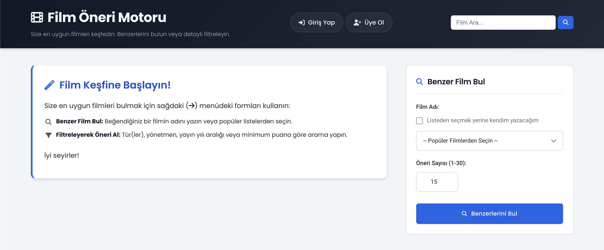
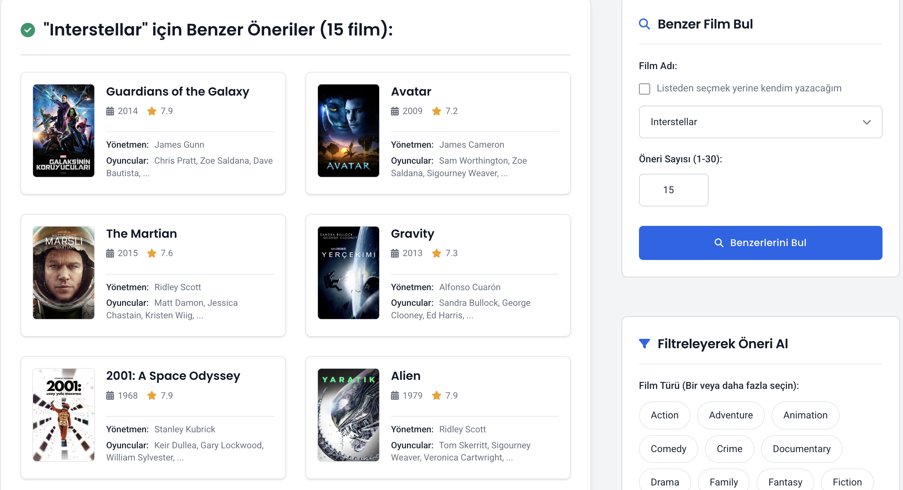
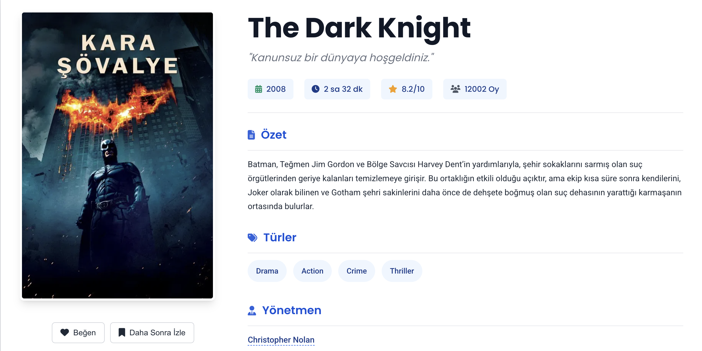
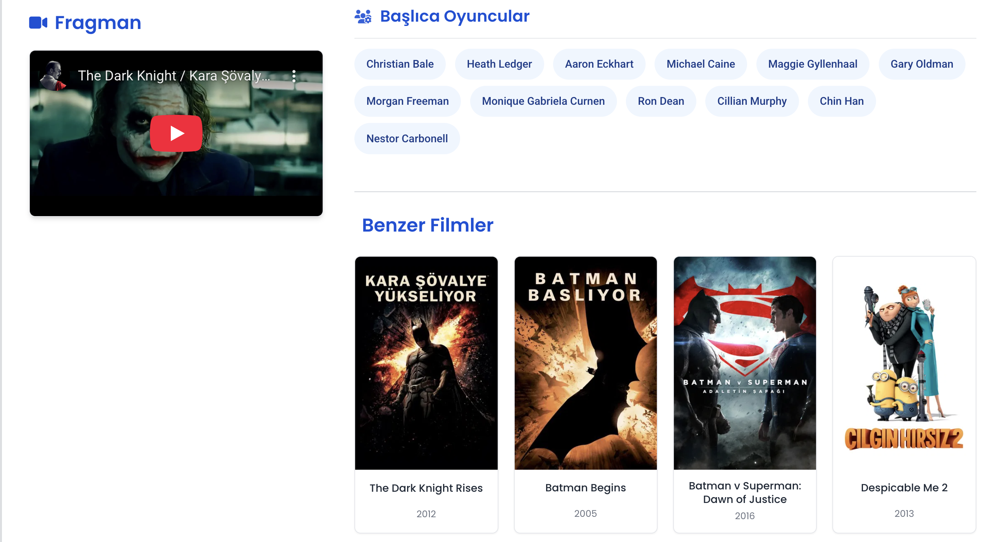

# 🎬 Film Öneri Sistemi / Movie Recommendation System

[](https://www.python.org/)
[](https://flask.palletsprojects.com/)
[](https://www.docker.com/)
[](https://scikit-learn.org/)

## 📸 Proje Önizlemesi / Project Preview

<p align="center">
  
  
  
  
  
</p>

## 🇹🇷 Türkçe

İçerik tabanlı filtreleme (Content-Based Filtering) ve TMDb API kullanarak kişiselleştirilmiş film önerileri sunan, modern arayüze sahip bir web uygulaması.

> 📚 **Eğitim Odaklı (Junior-Friendly) Mimari:**
> Bu projenin kod tabanı (Python dosyaları) **tamamen çift dilli (Türkçe-İngilizce)** ayrıntılı yorumlarla donatılmış ve "Single Responsibility" prensibine göre basitleştirilmiştir.

### ✨ Özellikler

- 🔍 **Film Benzerlik Araması (Content-Based Filtering)** — Seçtiğiniz bir filmin yönetmeni, türleri, anahtar kelimeleri ve konusunu (overview) analiz ederek matematiksel olarak en benzer filmleri bulur (TF-IDF + Kosinüs Benzerliği).
- 🎯 **Gelişmiş Çoklu Filtreleme Sistemi** — Sadece isimle değil; aynı anda belirli bir tür, spesifik bir yönetmen, vizyon yılı aralığı (Örn: 2010-2020) ve minimum IMDb puanı (Örn: 7.0+) belirleyerek çok hassas aramalar yapabilirsiniz.
- 👤 **Kullanıcı Sistemi & Session Yönetimi** — Kullanıcılar kendi hesaplarını oluşturup giriş yapabilir. Oturumlar (session) güvenli bir şekilde yönetilir ve veriler JSON tabanlı lokal bir sistemde saklanır.
- ❤️ **Kişiselleştirme (Favoriler & İzleme Listesi)** — Giriş yapan kullanıcılar, beğendikleri filmleri favorilerine ekleyebilir veya daha sonra izlemek üzere kendi izleme listelerine (Watchlist) kaydedebilirler.
- 🎭 **Zengin Detay (TMDb Entegrasyonu)** — Sadece veri setindeki düz yazılar değil, canlı TMDb API'si kullanılarak filmlerin güncel afişleri, oyuncu kadrosu, yönetmenlerin biyografileri ve diğer yönettikleri güncel filmler anlık olarak çekilir.
- 🐳 **Docker Desteği & İzolasyon** — Uygulama baştan sona konteynerize edilmiştir. Sunucuda veya lokal bilgisayarınızda sadece tek bir `docker-compose up` komutuyla, hiçbir Python kütüphanesi kurmadan izole bir ortamda ayağa kalkar.
- 🏎️ **Fuzzy String Matching (Bulanık Arama)** — Arama çubuğuna film adını yanlış veya eksik yazsanız bile (Örn: "batmn"), sistem TheFuzz kütüphanesini kullanarak aradığınızı anlar ve doğru filme yönlendirir.

---

### 🚀 Kurulum & Çalıştırma

Projeyi çalıştırmak için 2 farklı yol (Docker veya Manuel) mevcuttur.

#### 1. Veri Setini Hazırlama (Ortak Adım)
Proje çalışmak için [Kaggle TMDB 5000 Movie Dataset](https://www.kaggle.com/datasets/tmdb/tmdb-movie-metadata) dosyalarına ihtiyaç duyar.
Aşağıdaki dosyaları indirip ana dizindeki `dataset/` klasörünün içine yerleştirin:
- `tmdb_5000_movies.csv`
- `tmdb_5000_credits.csv`

#### 2. .env Dosyasını Hazırlama (Ortak Adım)
```bash
cp .env.example .env
```
`.env` dosyasını açıp TMDb API anahtarınızı girin. (Anahtarınızı [TMDb Ayarlar](https://www.themoviedb.org/settings/api) sayfasından alabilirsiniz.)

#### YÖNTEM A: Docker ile (Tavsiye Edilen) 🐳

Sisteminizde hiçbir Python eklentisi kurmadan uygulamayı tek komutla başlatabilirsiniz:

```bash
docker-compose up --build
```
Çalıştıktan sonra tarayıcınızda açın: **http://localhost:5001**

#### YÖNTEM B: Manuel (Sanal Ortam) ile 🐍

**1. Sanal ortam (venv veya conda) oluşturup aktifleştirin:**
```bash
python3 -m venv venv
source venv/bin/activate  # Windows: venv\Scripts\activate
```

**2. Kütüphaneleri kurun:**
```bash
pip install -r requirements.txt
```

**3. Uygulamayı başlatın:**
```bash
python app.py
```
Çalıştıktan sonra tarayıcınızda açın: **http://localhost:5001**

---

### 🧠 Öneri Motoru Nasıl Çalışır?

1. **Veri Ön İşleme (Preprocessing):** Veri setindeki (CSV) film özetleri, türleri, yönetmen ve oyuncu bilgileri tek tek toplanır. Eksik veriler (NaN) temizlenerek, her film için uzun ve tek parça bir "Özellik Metni" (Combined Features String) oluşturulur.
2. **Vektörizasyon (TF-IDF):** Matematiksel modeller metinleri okuyamayacağı için bu uzun özellik metinleri **TF-IDF (Term Frequency-Inverse Document Frequency)** modeli kullanılarak matematiksel vektörlere (sayılara) dönüştürülür. Sık kullanılan ama anlamsız bağlaçlar ('the', 'and') yoksayılır.
3. **Benzerlik Matrisi (Cosine Similarity):** Her bir filmin matematiksel vektörü, diğer 4800 filmin vektörü ile karşılaştırılır. **Kosinüs Benzerliği (Cosine Similarity)** kullanılarak iki film arasındaki açının kosinüsü hesaplanır ve her eşleşmeye 0 (hiç benzemiyor) ile 1 (birebir aynı) arasında bir benzerlik skoru atanır.
4. **Hibrit Skorlama (Hybrid Score):** Sadece "içerik benzerliği" yeterli değildir; kimse çok benzeyen ama kalitesiz veya 3 kişinin oy verdiği bir filmi izlemek istemez. Bu yüzden sistem, benzerlik skorunu alıp filmin **Orijinal Popülerliği**, **Oy Ortalaması (IMDb)** ve **Bilinirliği (Oy Sayısı)** ile belirli ağırlıklarla çarparak son bir "Tavsiye Edilebilirlik Skoru (Hybrid Score)" üretir ve algoritmayı mantıklı hale getirir.

---

### 📂 Proje Yapısı / Project Structure

```text
MovieRecommendation/
├── app.py                # Uygulama Ana Giriş Noktası / Main Application Entry Point
├── Dockerfile            # Docker İmaj Kurulum Dosyası / Docker Image Setup File
├── docker-compose.yml    # Docker Servis Orkestratörü / Docker Service Orchestrator
├── requirements.txt      # Python Bağımlılıkları / Python Dependencies
├── .env                  # Çevresel Değişkenler (TMDb Anahtarı) / Environment Variables
├── dataset/              # CSV veri setleri (Movies & Credits) / CSV datasets
├── static/               # CSS, JS ve Görsel Dosyalar / CSS, JS and Images
├── templates/            # HTML Şablonları (Jinja2) / HTML Templates (Jinja2)
└── src/                  # Çekirdek İş Mantığı Modülleri / Core Business Logic Modules
    ├── config.py         # Yapılandırma & Sabitler / Configuration & Constants
    ├── helpers.py        # Yardımcı Fonksiyonlar & API İstekleri / Helper Functions & API
    ├── recommendation.py # Makine Öğrenimi Motoru / Machine Learning Engine
    └── user_data.py      # Kullanıcı (JSON) Veri Yönetimi / User (JSON) Data Management
```

---
---

## 🇬🇧 English

A web application with a modern interface that provides personalized movie recommendations using Content-Based Filtering and the TMDb API.

> 📚 **Educational (Junior-Friendly) Architecture:**
> The codebase (Python files) of this project has been heavily commented in **both Turkish and English** and refactored for simplicity. It aims to read like a storybook, allowing junior developers to easily grasp complex ML algorithms and API handling.

### ✨ Features

- 🔍 **Film Similarity Search (Content-Based Filtering)** — Analyzes a selected movie's director, genres, keywords, and overview to mathematically find the most similar movies (TF-IDF + Cosine Similarity).
- 🎯 **Advanced Multi-Filtering System** — Search not just by name, but simultaneously filter by a specific genre, director, release year range (e.g., 2010-2020), and minimum IMDb rating (e.g., 7.0+).
- 👤 **User System & Session Management** — Users can create accounts and log in. Sessions are securely managed and data is stored in a local JSON-based storage engine.
- ❤️ **Personalization (Favorites & Watchlist)** — Logged-in users can bookmark their favorite movies or add them to their personal Watchlist for later.
- 🎭 **Rich Details (TMDb Integration)** — Instead of relying solely on offline static data, the system fetches real-time movie posters, cast lists, director biographies, and their recent works using the live TMDb API.
- 🐳 **Docker Support & Isolation** — The application is fully containerized. Boot up the entire environment locally or on a server with a single `docker-compose up` command, without installing any Python dependencies.
- 🏎️ **Fuzzy String Matching** — Even if you misspell a movie name in the search bar (e.g., "batmn"), the system uses the TheFuzz library to understand your intent and redirect you to the correct movie.

---

### 🚀 Setup & Execution

There are 2 ways to run the project (Docker or Manual).

#### 1. Prepare the Dataset (Common Step)
The project requires the [Kaggle TMDB 5000 Movie Dataset](https://www.kaggle.com/datasets/tmdb/tmdb-movie-metadata).
Download and place the following two files into the `dataset/` folder:
- `tmdb_5000_movies.csv`
- `tmdb_5000_credits.csv`

#### 2. Prepare the .env File (Common Step)
```bash
cp .env.example .env
```
Open the `.env` file and enter your TMDb API key. (Get it from [TMDb Settings](https://www.themoviedb.org/settings/api)).

#### METHOD A: Using Docker (Recommended) 🐳

Run the application with a single command without installing Python dependencies on your host system:

```bash
docker-compose up --build
```
Open in browser: **http://localhost:5001**

#### METHOD B: Manual (Virtual Environment) 🐍

**1. Create and activate a virtual environment:**
```bash
python3 -m venv venv
source venv/bin/activate  # Windows: venv\Scripts\activate
```

**2. Install dependencies:**
```bash
pip install -r requirements.txt
```

**3. Run the app:**
```bash
python app.py
```
Open in browser: **http://localhost:5001**

---

---

### 🧠 How the Recommendation Engine Works?

1. **Data Preprocessing:** Movie overviews, genres, director, and cast information from the dataset (CSV) are gathered. Missing data (NaN) is cleaned, and a long, single "Combined Features String" is generated for each movie.
2. **Vectorization (TF-IDF):** Since mathematical models cannot read text, these long feature strings are converted into mathematical vectors (numbers) using the **TF-IDF (Term Frequency-Inverse Document Frequency)** model. Common but meaningless stop words ('the', 'and') are ignored.
3. **Similarity Matrix (Cosine Similarity):** The mathematical vector of each movie is compared with the vectors of all other 4,800 movies. Using **Cosine Similarity**, the cosine of the angle between two movies is calculated, assigning a similarity score between 0 (not similar at all) and 1 (exact match) to each pair.
4. **Hybrid Scoring:** Relying solely on "content similarity" is flawed; users rarely want to watch a highly similar but terrible movie with only 3 votes. Therefore, the system takes the similarity score and multiplies it by the movie's **Original Popularity**, **Vote Average (IMDb)**, and **Vote Count** using specific weights. This produces a final "Recommendability Score (Hybrid Score)", making the algorithm logical and reliable.

---

### 📦 Technologies & Libraries

| Technology | Usage Category |
|-----------|----------|
| **Python 3.10+ / Flask** | Backend Web Framework & Routing |
| **Pandas** | Data extraction, manipulation & cleaning |
| **Scikit-learn** | Machine Learning (TF-IDF, Cosine Similarity) |
| **TheFuzz** | Fuzzy String Matching for search bars |
| **Jinja2** | Front-end HTML Template engine |
| **Docker** | Containerization & Deployment |

---

## 📝 Lisans / License
This project is for educational purposes. / Bu proje eğitim amaçlıdır.

## 🙏 Teşekkürler / Credits
- [TMDb](https://www.themoviedb.org/) — Movie Data API
- [Kaggle](https://www.kaggle.com/datasets/tmdb/tmdb-movie-metadata) — Dataset Provider
